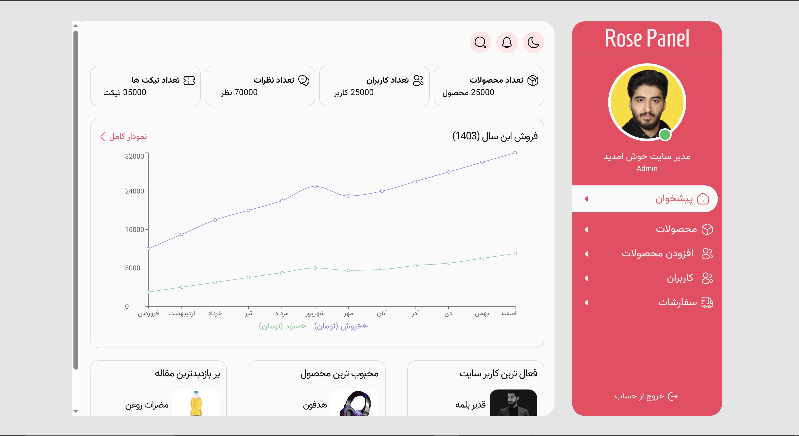

# 🧩 CMS Panel

A lightweight and modern content management dashboard built with **React**, **TypeScript**, and **Vite**. This project utilizes **Tailwind CSS** for styling and **react-hook-form** with **Zod** for robust form validation.

## ✨ Features

- 📦 Product management: Add, edit, and delete products
- 🧾 Form validation with react-hook-form & Zod
- 💬 User-friendly alerts using SweetAlert2
- ⚡️ Fast development with Vite and HMR
- 🎨 Styled with Tailwind CSS
- 🗂️ Organized file structure for scalability

## 📸 Screenshot



> Ensure that the `screenshot.png` image is placed in the `public` directory of your project.

## 🚀 Getting Started

### Prerequisites

- Node.js (v16 or later)
- npm or yarn

### Installation

1. Clone the repository:

   ```bash
   git clone https://github.com/mohsen-sadeghi/cms-panel.git
   cd cms-panel```

2. Install dependencies:

   ```bash
   npm install
   # or
   yarn install```

3. start json server :
   ```bash
   npx json-server db.json
   ```

4. Start the development server:

   ```bash
   npm run dev
   # or
   yarn dev```

The application will be available at http://localhost:5173.

## 📦 Built With

- [React](https://reactjs.org/) – A JavaScript library for building user interfaces
- [TypeScript](https://www.typescriptlang.org/) – Strongly typed programming language that builds on JavaScript
- [Vite](https://vitejs.dev/) – Next generation frontend tooling
- [Tailwind CSS](https://tailwindcss.com/) – Utility-first CSS framework for rapid UI development
- [react-hook-form](https://react-hook-form.com/) – Performant, flexible and extensible forms with easy-to-use validation
- [Zod](https://zod.dev/) – TypeScript-first schema declaration and validation library
- [SweetAlert2](https://sweetalert2.github.io/) – Beautiful, responsive, customizable, accessible (WAI-ARIA) replacement for JavaScript’s popup boxes